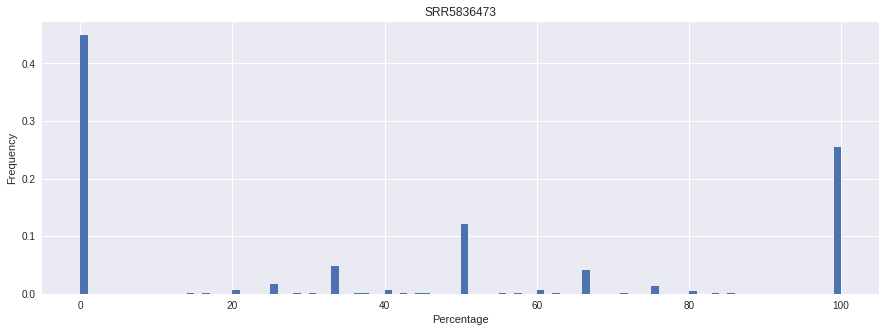

# hse_hw1_meth

[Ссылка на Colab notebook](https://colab.research.google.com/drive/1eflogSbJVe9mPT4JNg01PI6u-MTN1NQs)

## Отчет _SRR3824222_1.fastq_

| Параметр                     | SRR3824222_1.fastq                           |
|:----------------------------:|:--------------------------------------------:|
| Basic statistics             |  |
| Per base sequence content    |      |
| Per sequence GC content      |        |

В _Per base sequence content_ видно, что для _SRR3824222_ уровень цитозинов довольно низкий, почти нулевой; cодержание гуанина, также низкое.

В _Per sequence GC content_ заметно следующее: нормальное распределение смещено влево. Это отражает данные из _Basic statistics_.

## Риды

|  Sequence  | _11347700-11367700_ | _40185800-40195800_ | Deduplication |
|:----------:|:-------------------:|:-------------------:|:-------------:|
| Epiblast | 2328                | 1062                | 97.08%        |
| ICM | 1456                | 630                 | 90.92%        |
| 8 Cell | 1090                | 464                 | 81.69%        |

## M-Bias

| Последовательность | 1 рид                                                  | 2 рид                                                  |
|:------------------:|:------------------------------------------------------:|:------------------------------------------------------:|
| SRR3824222         |       |       |
| SRR5836473         |       |       |
| SRR5836475         |       |       |

## Распределение метелирования цитозинов по хромосоме

| **Название** | **Гистограмма**             |
|:------------:|:---------------------------:|
| Epiblast     |  |
| 8 cell        |  |
| ICM          |  |

## Уровень метелирования и покрытия

для _chr11:3100030-3400030_

